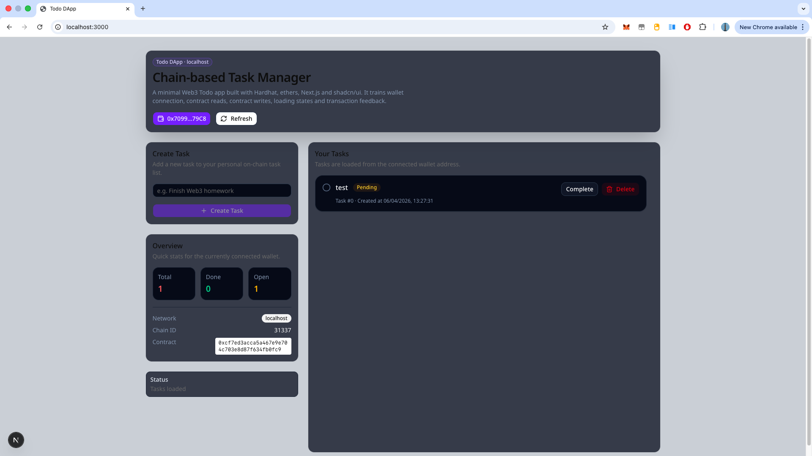
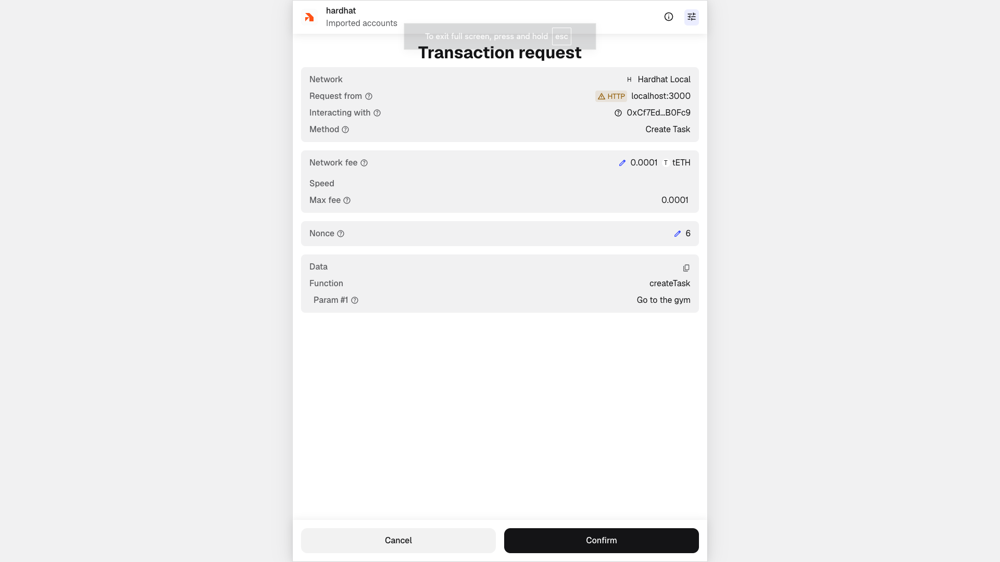
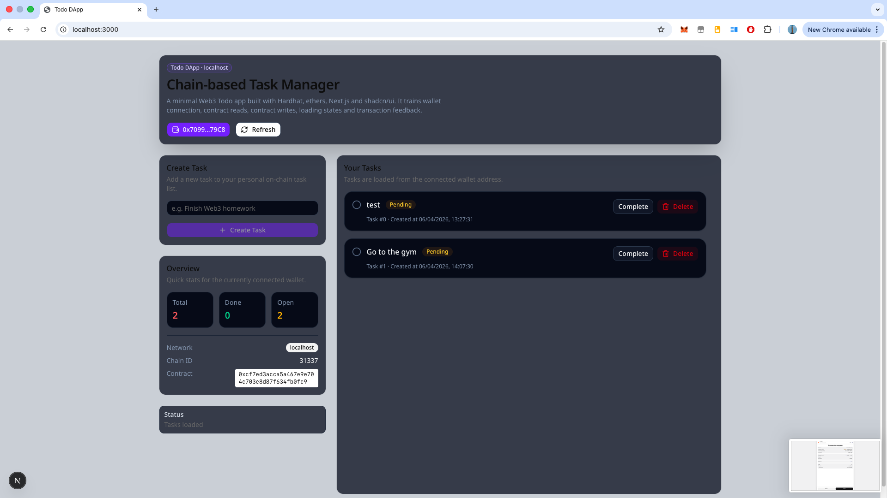

# Todo DApp

A simple full-stack Web3 Todo application built with **Hardhat**, **Solidity**, **Next.js**, **ethers.js**, and **shadcn/ui**.

This project is a beginner-friendly demo for learning how to build a decentralized application with both a **smart contract backend** and a **modern frontend**.

---

<p align="center">
  
  
  
</p>

## Features

- Connect wallet with MetaMask
- Switch to local Hardhat network
- Create on-chain tasks
- Read tasks for the connected wallet
- Mark tasks as completed or reopen them
- Delete tasks
- View task statistics in a clean dashboard UI
- Handle loading, transaction status, and errors in the frontend

---

## Tech Stack

### Blockchain / Smart Contract

- Solidity
- Hardhat 3
- viem

### Frontend

- Next.js
- React
- TypeScript
- ethers.js
- Tailwind CSS
- shadcn/ui
- lucide-react

---

## Project Structure

```text
todo-dapp/
├── hardhat/
│   ├── contracts/
│   │   ├── Counter.sol
│   │   ├── Counter.t.sol
│   │   └── TaskManager.sol
│   ├── scripts/
│   │   ├── deploy.ts
│   │   └── send-op-tx.ts
│   ├── deployments/
│   │   └── localhost.json
│   ├── hardhat.config.ts
│   └── test/
│
├── web/
│   ├── app/
│   │   ├── layout.tsx
│   │   └── page.tsx
│   ├── components/
│   │   ├── todo/
│   │   │   ├── CreateTaskCard.tsx
│   │   │   ├── OverviewCard.tsx
│   │   │   ├── TaskListCard.tsx
│   │   │   └── TodoHeader.tsx
│   │   └── ui/
│   ├── hooks/
│   │   └── useTaskManager.ts
│   ├── lib/
│   │   ├── abi.ts
│   │   ├── config.ts
│   │   └── utils.ts
│   ├── styles/
│   │   └── globals.css
│   └── Types/
│       └── task_types.ts
│
└── README.md

```

⸻

## How It Works

### Smart Contract

The core contract is TaskManager.sol.

It allows each wallet address to manage its own on-chain task list.
Each task includes:

- task content
- completion status
- creation timestamp

The contract supports:

- createTask
- getMyTasks
- toggleTask
- deleteTask

### Frontend

The frontend is built with Next.js and ethers.js.

It provides:

- wallet connection
- local network switching
- contract reads and writes
- task creation and task management UI
- transaction feedback and loading states

The main frontend logic lives in:

web/hooks/useTaskManager.ts

⸻

## Getting Started

1. Start the local blockchain

```
cd hardhat
npx hardhat node

```

2. Deploy the contract

In another terminal:

```
cd hardhat
npx hardhat run scripts/deploy.ts --network localhost

```

This will:

- deploy the TaskManager contract
- save deployment info into hardhat/deployments/localhost.json
- write frontend environment variables into web/.env.local

3. Start the frontend

```
cd web
npm run dev

```

Then open the local app in your browser.

⸻

## MetaMask Setup

To use the project locally, add the Hardhat local network to MetaMask:

- Network Name: Hardhat Local
- RPC URL: http://127.0.0.1:8545
- Chain ID: 31337
- Currency Symbol: ETH

You should also import one of the default Hardhat test accounts into MetaMask.

⸻

## Learning Goals

This project is useful for practicing:

- Solidity basics
- mappings, structs, and arrays
- contract deployment with Hardhat
- wallet connection in Next.js
- reading and writing on-chain data
- React state management for Web3 interactions
- transaction loading and error handling
- building a small but complete DApp workflow

⸻

## Current Scope

This project is intentionally simple.

It is designed for:

- learning
- experimentation
- frontend + contract integration practice

It is not intended for production use.

⸻

## Future Improvements

Possible next steps include:

- toast notifications
- better transaction history UI
- task filtering
- multi-user task views
- testnet deployment
- contract event indexing
- improved animations and micro-interactions

⸻

License

MIT
